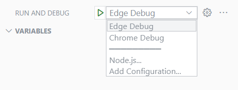

# S2Hand (https://s2hand-dev.web.app/)

Second hand sale site for students. This school project is tended to have Front-End only. Tech stack:

- ReactJS
- Redux
- TypeScript (ES6)
- Bootstrap

## Pre-Require

To run this project properly, you should have:

- NodeJS v14.15.5 (or any LTS version > 12)
- VSCode (Not a must but I hope your code editor have those following extension)
- Debugger for Chrome/ Debugger for Edge: For debugging
- ESLint (Dirk Baeume): ESLint is a tool for identifying and reporting on patterns found in ECMAScript/JavaScript code, with the goal of making code more consistent and avoiding bugs.
- Prettier Code Formatter (Prettier): Code formatter

Optional extensions:

- GitLens — Git supercharged: Give you information about commits in each line of code

## Run

In the project directory:

- Run `npm i` to install necessary dependencies
- `npm start` to start our web site

## Debug

- Run `npm start`
- Choose debug with Chrome or Edge
- Press start button or F5

## Create Production Build

Run `npm run build`

